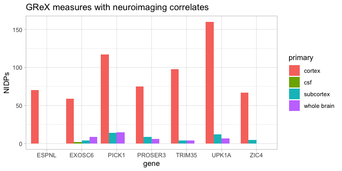
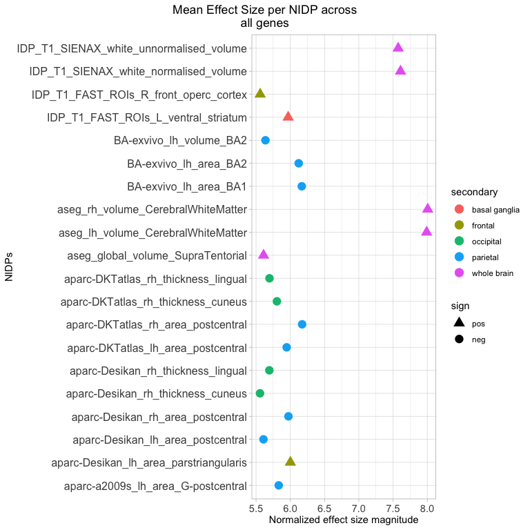
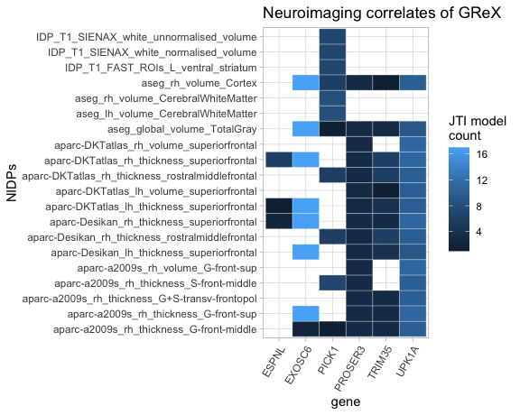
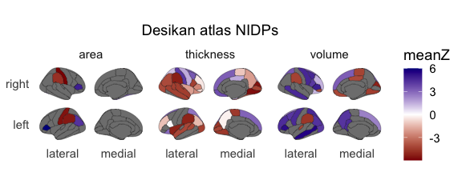
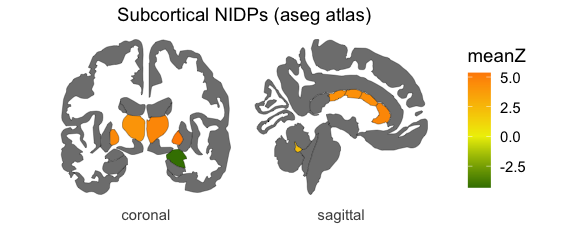

# NeuroimaGene R project

Hi, Welcome to the NeuroimaGene project!  

The goal of this project is to improve the interpretability of genetic studies relating to neurological and/or psychiatric traits. Analyses such as genome-wide association studies often highlight genetic variants that segregate with disease. Methods such as fine mapping, eQTL colocalization, and transcriptome-wide analyses (TWAS) have been developed to identify the gene level targets of these trait-associated variants. Once a set of gene targets has been identified from GWAS findings, it often remains challenging to identify the biological consequences of variation in these genes. Briefly, **the NeuroimaGene R package makes it possible to identify the neuroimaging correlates of TWAS associations.**  

More specifically, NeuroimaGene can be used to (1) characterize individual genes or gene sets as relevant to the structure and function of the brain, (2) identify the region(s) of the brain or body in which expression of target gene(s) is neurologically relevant, (3) impute the brain features most impacted by user-defined gene sets such as those produced by cohort level gene association studies, and (4) generate publication level, modifiable visual plots of neuroimaGene associations. 

## Installation

We recommend installing the NeuroimaGene package directly from CRAN. Use the following script in the R console:

```R
install.packages("neuroimaGene")
```

### Github Installation
You can also install the `NeuroimaGene` package directly from GitHub using the `devtools` package. First, ensure you have `devtools` installed. Then, use the `install_github` function to install the package from the GitHub repository.

### Step-by-Step Instructions

1. **Install `devtools`**:
    If you don't have the `devtools` package installed, you can install it from CRAN:

    ```R
    install.packages("devtools")
    ```

2. **Install `NeuroimaGene` from GitHub**:
    Use the `install_github` function from the `devtools` package to install `NeuroimaGene`:

    ```R
    devtools::install_github("xbledsoe/NeuroimaGene_R")
    ```

3. **Load the Package**:
    Once installed, you can load the `NeuroimaGene` package as follows:

    ```R
    library(neuroimaGene)
    ```

Here is a complete example in R:

```R
# Install devtools if not already installed
install.packages("devtools")

# Install the NeuroimaGene package from GitHub
devtools::install_github("xbledsoe/NeuroimaGene_R")

# Load the package
library(neuroimaGene)
```
## Using the NeuroimaGene R package

The NeuroimaGene R package serves to identify, characterize, and
visualize the neurological correlates of genetically regulated gene
expression (GReX). The following functions serve this goal.

### The main neuroimaGene query

The main package function, `neuroimaGene()` takes a vector of gene names
(HUGO gene names or ensembl id’s) and returns a data table of GReX-NIDP
associations that fit a number of user-defined parameters described
below:

`ng <- neuroimaGene( gene_list, modality='T1', atlas='Desikan', mtc='BH', nidps = NA, filename = NA)`

##### Short Parameter Descriptions:

> **gene\_list**: a vector of gene names (HUGO gene names or ensembl
> id’s). Typically these are associated with a single trait of interest.
>
> **modality**: the MRI modality used to define the NIDP in the initial
> UK Biobank imaging protocol. *(See table below for options)*
>
> **atlas**: the parcellation atlas used to define the NIDPs from the
> MRI. We use the term “atlas” loosely recognizing that the fMRI data,
> dMRI data, and T1/T2 data are parcellated in diverse ways. *(See table
> below for options)*
>
> **mtc**: Multiple Testing Correction. Options include Nominal (nom),
> Benjamini Hochberg (BH), or Bonferroni (BF)
>
> **nidps**: A user-defined list of NIDPs to test. This option overrides
> the modality and atlas parameters. Default is NA.
>
> **filename**: A user-defined pathname/filename for text output of the
> NeuroimaGene results.

<details>
<summary>
<b>Extended Parameter Descriptions</b>
</summary>

**Modality and Atlas parameters**

In the process of using the tool, the user is responsible for selecting
a subset of NIDPs from the resource for analysis using the `modality`
and `atlas` parameters. These parameters allow the user to target
specific types of NIDPs such as hippocampal subfields, area and
thickness of named cortical regions, fractional anisotropy of named
white matter tracts etc. It is recommended to identify the type of brain
measure one is interested in prior to performing the gene set analysis.
**The input options for the modality and atlas parameters are detailed
in the dropdown table below**

**Multiple Testing Correction Parameter for statistical significance**

In addition to selecting the atlas and modality, neuroimaGene requires a
multiple testing threshold correction. Each imaging modality contains a
different number of NIDPs (see table above). The Bonferroni correction
(‘BF’) treats each of these NIDPs as independent even though we know
through significant data analyses that this is not accurate. This is a
highly conservative threshold that will yield high confidence
associations but is likely to generate many false negatives. Recognizing
the correlation of brain measures from the same modality and atlas, we
recommend using the less stringent Benjamini Hochberg (‘BH’) False
Discovery Rate for discovery analyses. The nominal option (‘nom’) will
provide the uncorrected p-value.

Note that the `mtc` parameter represents a study-wide is dynamic,
depending on the modality and atlas parameters provided in the initial
neuroimaGene query.

1.  If a user provides an atlas, multiple testing correction will be
    calculated at an atlas-wide level.

2.  If the user provides a modality but sets the atlas as NA or ‘all’,
    multiple testing correction will be calculated at a modality-wide
    level.

3.  If the user sets the both the modality and atlas to NA or ‘all’, the
    correction will be applied to the entire data set.

The above bullet points apply to both the Bonferroni (BF) and Benjamini
Hochberg (BH) corrections. Alpha is set to 0.05 in either case.

**Providing a user selected set of NIDP names**

If the user has a specific set of NIDPs that they would like to assess,
the `nidps` parameter receives a vector of NIDPs by name. The NIDP names
all include data about the modality, atlas, region, and hemisphere. The
names have to be provided in character form and matching must be
perfect. To aid with the user-provision of NIDPs, we include the helper
utility `listNIDPs()`. This function takes as parameters `modality` and
`atlas` and returns a list of all NIDP names that satisfy these
criteria. The user can then manually curate a list of desired NIDPs.

Note that when providing a user-defined set of NIDPs, this option
overrides the modality and atlas parameters. This applies both to the
set of NIDPs analyze as well as the multiple testing correction. The
nominal p-value will be reported as both the Bonferroni and
Benjamini-Hochberg corrections that are encoded rely on knowing the set
of NIDPs being tested. The user NIDP input violates this assumption and
requires the user to identify their own multiple testing threshold.

</p>
</details>

##### NIDP modality and atlas descriptions:

See dropdown table for NIDP descriptions and source links

<details>
<summary>
<b>NIDP atlas descriptions and source links</b>
</summary>
<p>

<table>
<colgroup>
<col style="width: 20%" />
<col style="width: 20%" />
<col style="width: 20%" />
<col style="width: 20%" />
<col style="width: 20%" />
</colgroup>
<thead>
<tr class="header">
<th>Modality</th>
<th>Atlas name</th>
<th># of NIDPs</th>
<th>Description</th>
<th>source</th>
</tr>
</thead>
<tbody>
<tr class="odd">
<td>T1</td>
<td>all</td>
<td>1319</td>
<td>All measures recorded by the UKB neuroimaging study derived from T1
imaging</td>
<td>see note*</td>
</tr>
<tr class="even">
<td>T1</td>
<td>Destrieux</td>
<td>444</td>
<td>Destrieux atlas parcellation of cortical sulci and gyri</td>
<td><a
href="https://doi.org/10.1016/j.neuroimage.2010.06.010">Destrieux</a></td>
</tr>
<tr class="odd">
<td>T1</td>
<td>AmygNuclei</td>
<td>20</td>
<td>morphology of Nuclei of the amygdala</td>
<td><a href="https://doi.org/10.1016/j.neuroimage.2017.04.046">Amygdala
nuclei</a></td>
</tr>
<tr class="even">
<td>T1</td>
<td>Subcortex</td>
<td>52</td>
<td>subcortical volumetric segmentation</td>
<td><a
href="https://doi.org/10.1016/S0896-6273(02)00569-X">aseg_volume</a></td>
</tr>
<tr class="odd">
<td>T1</td>
<td>Broadmann</td>
<td>84</td>
<td>cortical morphology via Broadmann Areas</td>
<td><a href="https://doi.org/10.1093/cercor/bhm225">Broadmann</a></td>
</tr>
<tr class="even">
<td>T1</td>
<td>Desikan</td>
<td>202</td>
<td>Desikan Killiany atlas parcellation of cortical morphology</td>
<td><a
href="https://doi.org/10.1016/j.neuroimage.2006.01.021">Desikan</a></td>
</tr>
<tr class="odd">
<td>T1</td>
<td>DKT</td>
<td>186</td>
<td>DKT atlas parcellation of cortical morphology</td>
<td><a href="https://doi.org/10.3389/fnins.2012.00171">DKTatlas</a></td>
</tr>
<tr class="even">
<td>T1</td>
<td>FAST</td>
<td>139</td>
<td>cortical morphology via FMRIB’s Automatic Segmentation Tool</td>
<td><a href="https://doi.org/10.1109/42.906424">FAST</a></td>
</tr>
<tr class="odd">
<td>T1</td>
<td>FIRST</td>
<td>15</td>
<td>Subcortical morphology via FIRST</td>
<td><a
href="https://doi.org/10.1016/j.neuroimage.2011.02.046">FIRST</a></td>
</tr>
<tr class="even">
<td>T1</td>
<td>HippSubfield</td>
<td>44</td>
<td>morphology of Hippocampal subfields</td>
<td><a
href="https://doi.org/10.1016/j.neuroimage.2015.04.042">HippSubfield</a></td>
</tr>
<tr class="odd">
<td>T1</td>
<td>pial</td>
<td>66</td>
<td>structure: Desikan Killiany atlas of the pial surface</td>
<td><a
href="https://doi.org/10.1016/j.neuroimage.2006.01.021">Desikan</a></td>
</tr>
<tr class="even">
<td>T1</td>
<td>Brainstem</td>
<td>5</td>
<td>structure: Freesurfer brainstem parcellation</td>
<td><a
href="https://doi.org/10.1016/j.neuroimage.2015.02.065">Brainstem</a></td>
</tr>
<tr class="odd">
<td>T1</td>
<td>SIENAX</td>
<td>10</td>
<td>structure: Structural Image Evaluation of whole brain measures</td>
<td><a href="https://doi.org/10.1006/nimg.2002.1040">SIENAX</a></td>
</tr>
<tr class="even">
<td>T1</td>
<td>ThalamNuclei</td>
<td>52</td>
<td>morphology of the Nuclei of the thalamus</td>
<td><a
href="https://doi.org/10.1038/s41597-021-01062-y">ThalamNuclei</a></td>
</tr>
<tr class="odd">
<td>dMRI</td>
<td>all</td>
<td>675</td>
<td>All measures recorded by the UKB neuroimaging study derived from DWI
imaging</td>
<td>see note*</td>
</tr>
<tr class="even">
<td>dMRI</td>
<td>ProbtrackX</td>
<td>243</td>
<td>white matter mapping obtained via probabilistic tractography</td>
<td><a
href="https://doi.org/10.1371/journal.pone.0061892">ProbtrackX</a>*</td>
</tr>
<tr class="odd">
<td>dMRI</td>
<td>TBSS</td>
<td>432</td>
<td>white matter mapping obtained via tract-based spatial
statistics</td>
<td><a
href="https://doi.org/10.1016/j.neuroimage.2006.02.024">TBSS</a>*</td>
</tr>
<tr class="even">
<td>rfMRI</td>
<td>ICA100</td>
<td>1485</td>
<td>functional connectivity using 100 cortical seeds</td>
<td>see note*</td>
</tr>
<tr class="odd">
<td>rfMRI</td>
<td>ICA25</td>
<td>210</td>
<td>functional connectivity using 25 cortical seeds</td>
<td>see note*</td>
</tr>
<tr class="even">
<td>rfMRI</td>
<td>ICA-features</td>
<td>6</td>
<td>summary of functional connectivity components</td>
<td>see note*</td>
</tr>
<tr class="odd">
<td>T2_FLAIR</td>
<td>BIANCA</td>
<td>1</td>
<td>white matter hyperintensity classification algorithm</td>
<td><a
href="https://doi.org/10.1016%2Fj.neuroimage.2016.07.018">BIANCA</a></td>
</tr>
<tr class="even">
<td>T2star</td>
<td>SWI</td>
<td>14</td>
<td>susceptibility-weighted imaging: microhemorrhage and hemosiderin
deposits</td>
<td>see note*</td>
</tr>
</tbody>
</table>

\* original publication for details
[here](https://doi.org/10.1016/j.neuroimage.2017.10.034)
(Alfaro-Almagro, Fidel, et al. “Image processing and Quality Control for
the first 10,000 brain imaging datasets from UK Biobank.” Neuroimage 166
(2018): 400-424.)

</p>
</details>

### Example NeuroimaGene Query:

    library(neuroimaGene, quietly = TRUE)
    gene_list <- c('TRIM35', 'PROSER3', 'EXOSC6', 'PICK1', 'UPK1A', 'ESPNL', 'ZIC4')
    ng <- neuroimaGene(gene_list, atlas = NA, mtc = 'BH', vignette = TRUE)


<table>
<colgroup>
<col style="width: 14%" />
<col style="width: 8%" />
<col style="width: 41%" />
<col style="width: 16%" />
<col style="width: 8%" />
<col style="width: 9%" />
</colgroup>
<thead>
<tr class="header">
<th style="text-align: left;">gene</th>
<th style="text-align: left;">gene_name</th>
<th style="text-align: left;">gwas_phenotype</th>
<th style="text-align: left;">training_model</th>
<th style="text-align: right;">zscore</th>
<th style="text-align: right;">mod_BHpval</th>
</tr>
</thead>
<tbody>
<tr class="odd">
<td style="text-align: left;">ENSG00000223496</td>
<td style="text-align: left;">EXOSC6</td>
<td
style="text-align: left;">aparc-a2009s_lh_thickness_G-front-middle</td>
<td style="text-align: left;">JTI_Adrenal_Gland</td>
<td style="text-align: right;">4.160209</td>
<td style="text-align: right;">0.0357891</td>
</tr>
<tr class="even">
<td style="text-align: left;">ENSG00000223496</td>
<td style="text-align: left;">EXOSC6</td>
<td style="text-align: left;">aparc-a2009s_lh_thickness_G-front-sup</td>
<td style="text-align: left;">JTI_Adrenal_Gland</td>
<td style="text-align: right;">5.163521</td>
<td style="text-align: right;">0.0012963</td>
</tr>
<tr class="odd">
<td style="text-align: left;">ENSG00000223496</td>
<td style="text-align: left;">EXOSC6</td>
<td
style="text-align: left;">aparc-a2009s_lh_thickness_G-parietal-sup</td>
<td style="text-align: left;">JTI_Adrenal_Gland</td>
<td style="text-align: right;">5.099214</td>
<td style="text-align: right;">0.0016672</td>
</tr>
<tr class="even">
<td style="text-align: left;">ENSG00000144488</td>
<td style="text-align: left;">ESPNL</td>
<td
style="text-align: left;">aparc-a2009s_lh_thickness_G-parietal-sup</td>
<td style="text-align: left;">JTI_Adrenal_Gland</td>
<td style="text-align: right;">-4.306351</td>
<td style="text-align: right;">0.0241802</td>
</tr>
<tr class="odd">
<td style="text-align: left;">ENSG00000144488</td>
<td style="text-align: left;">ESPNL</td>
<td
style="text-align: left;">aparc-a2009s_lh_thickness_G-pariet-inf-Angular</td>
<td style="text-align: left;">JTI_Adrenal_Gland</td>
<td style="text-align: right;">-6.103620</td>
<td style="text-align: right;">0.0000168</td>
</tr>
<tr class="even">
<td style="text-align: left;">ENSG00000223496</td>
<td style="text-align: left;">EXOSC6</td>
<td
style="text-align: left;">aparc-a2009s_lh_thickness_G-pariet-inf-Angular</td>
<td style="text-align: left;">JTI_Adrenal_Gland</td>
<td style="text-align: right;">4.362468</td>
<td style="text-align: right;">0.0205838</td>
</tr>
</tbody>
</table>

### Statistical visualizations

##### Genes

Users may wish to know the comparative contribution of each gene from
the provided list to the NeuroimaGene results. We include a function to
visualize the number of NIDPs per gene in the neuroimaGene package.

    plot_gns(ng, maxGns = 15)



<p>

The legend describes the primary measurement of the NIDPs For structural
data, this is the cortex, subcortex, CSF, or whole brain measurements.
The parameter `maxGns` describes the maximum number of genes to display.
It is set to a default of 15. Genes are selected by ranking the
neuroimagene genes by their zscore magnitudes and selecting the top N
genes.

Note that this plot does not reflect any information on the number of
tissue contexts in which the GReX-NIDP association is significant. This
data is better captured by the `plot_gnNIDP()` function.

<p>

##### Neuroimaging Derived Phenotypes (NIDPs)

<p>

It is also useful to see what NIDPs are most impacted by the genes
provided. The `plot_nidps()` function calculates the mean zscore for
each NIDP across all tissue models and genes. It amounts to an
aggregated effect of the genes on the region of interest. This linear
aggregation is an approximation best understood to show convergence in
effect size magnitude and direction.

    plot_nidps(ng, maxNidps = 20)



<p>

The legend describes a narrower descriptive profile of the NIDPs than
the `plot_gns()` tool. The parameter `maxNidps` describes the maximum
number of NIDPs to display. It is set to a default of 30. NIDPs are
selected by ranking the NIDPs by their zscore magnitudes and selecting
the top N NIDPs.

##### Genes and Neuroimaging Derived Phenotypes (NIDPs)

<p>

It is also useful to see the intersection of genes and NIDPs. The
`plot_gnNIDP()` function shows the number of JTI models in which each
GReX-NIDP association is significant.

    plot_gnNIDP(ng, maxNidps = 20, maxGns = 15)



<p>

The parameter `maxNidps` describes the maximum number of NIDPs to
display. It is set to a default of 20. NIDPs are selected by ranking the
NIDPs by their zscore magnitudes and selecting the top N NIDPs. The
parameter `maxGns` describes the maximum number of genes to display. It
is set to a default of 15. Genes are selected by ranking the
neuroimagene genes by their zscore magnitudes and selecting the top N
genes.

##### 2-Dimensional brain visualization of GReX-NIDP associations

It is often useful to provide a visual representation of neuroimaging
features in their 2-dimensional biological context for presentation
purposes. We include the `neuro_vis()` function for this purpose. This
function calculates the mean normalized effect size for each NIDP in the
neuroimaGene object. The user must provide a number of parameters listed
below.

    ng_obj  - NeuroimaGene object produced by neuroimaGene() function
    atlas   - desired atlas for visualization. (Desikan[default], Subcortex, DKT, Destrieux)
    lowcol  - color for low end of Zscore spectrum. Default is darkred
    midcol  - color for middle of Zscore spectrum. Default is white
    hicol   - color for top end of Zscore spectrum. Default is blue4

The function only reflects cortical and subcortical measures. It will
automatically separate the NIDPs according to volume, thickness, and
surface areas and plot each as its own facet. Please note that this
function uses the `ggseg` package and select atlases from the
`ggsegExtra` package. Please be sure to cite the creators of ggseg if
using this feature in publications.

> Mowinckel AM, Vidal-Piñeiro D (2019). “Visualisation of Brain
> Statistics with R-packages ggseg and ggseg3d.” 1912.08200.

The `neuro_vis()` function can be used as described below:

    neuro_vis(ng, atlas = 'Desikan', lowcol = 'darkred', midcol = 'white', highcol = 'blue4')
    #> merging atlas and data by 'label', 'atlas', 'roi'




    neuro_vis(ng, atlas = 'Subcortex', lowcol = 'darkgreen', midcol = 'yellow2', highcol = 'darkorange')
    #> merging atlas and data by 'label', 'atlas', 'side'



## Limitations

There are several key limitations to this resource that we wish to
highlight here.

-   **First**, neuroimaGene describes associations between NIDPs and
    predicted genetically regulated gene expression (GReX). GReX
    represents the proportion of gene expression that is genetically
    determined. Genes that affect a phenotype through protein
    dysfunction will not show up in neuroimaGene so long as the
    underlying mRNA expression remains unchanged.

-   **Second**, the tissue context of the GReX-NIDP association is not
    causal. GReX-NIDP associations are frequently significant in
    multiple tissue contexts. In these circumstances, we do not yet have
    sufficient methods to identify the causal tissue. Even when the GReX
    measure is only associated with the NIDP in a single tissue, it is
    important to note that GReX cannot be said to be causal in this
    tissue without further analyses.

-   **Third**, while GReX associations are derived from SNP data which
    is not affected by environment, the S-PrediXcan methodology is still
    susceptible to confounding from linkage disequilibrium of input
    SNPs. For causal inference, we recommend applying methods such as
    MR-JTI (Zhou et al 2020) to the GReX-NIDP associations as a post-hoc
    test to adjust the association statistics by quantifying and
    accounting for genetic heterogeneity.

*Please see our publication for a more extended discussion on
limitations.*

### Terminology

    GWAS  - Genome Wide Association Study
    TWAS  - Transcriptome Wide Association Study
    GReX  - Genetically regulated gene expression
    JTI   - Joint Tissue Imputation (link)
    NIDP  - Neuroimaging Derived Phenotype
    MRI   - Magnetic resonance imaging
    T1    - MRI modality classically used for structural characterization of the brain
    dMRI  - diffusion weighted MRI (used in our data for white matter tractography)
    fMRI  - functional MRI used for examining coordinated activity across regions of the brain 
    UKB   - United Kingdom Biobank
    eQTL  - expression Quantitative Trait Locus
    GTEx  - Genotype Tissue Expression Consortium

#### Associated papers for further reading

Barbeira, Alvaro N., et al. “Exploring the phenotypic consequences of
tissue specific gene expression variation inferred from GWAS summary
statistics.” Nature communications 9.1 (2018): 1-20.

Zhou, Dan, et al. “A unified framework for joint-tissue
transcriptome-wide association and Mendelian randomization analysis.”
Nature genetics 52.11 (2020): 1239-1246.

Miller, Karla L., et al. “Multimodal population brain imaging in the UK
Biobank prospective epidemiological study.” Nature neuroscience 19.11
(2016): 1523-1536.

Smith, Stephen M., et al. “An expanded set of genome-wide association
studies of brain imaging phenotypes in UK Biobank.” Nature neuroscience
24.5 (2021): 737-745.

Elliott, Lloyd T., et al. “Genome-wide association studies of brain
imaging phenotypes in UK Biobank.” Nature 562.7726 (2018): 210-216.

Gamazon, Eric R., et al. “Multi-tissue transcriptome analyses identify
genetic mechanisms underlying neuropsychiatric traits.” Nature genetics
51.6 (2019): 933-940.

Mowinckel, Athanasia M., and Didac Vidal-Piñeiro. “Visualization of
brain statistics with R packages ggseg and ggseg3d.” Advances in Methods
and Practices in Psychological Science 3.4 (2020): 466-483.

> Please direct all questions to me at the following email:
> <xbledsoe22@gmail.com>
