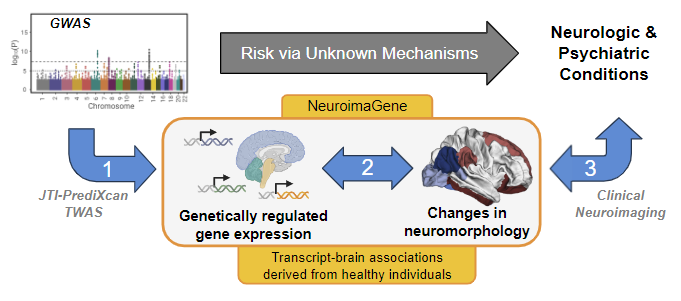

```{r setup, include = FALSE}
library(knitr)
knitr::opts_chunk$set(
  collapse = TRUE,
  comment = "#>"
  )
```
## Introduction
Hi, Welcome to the NeuroimaGene project!  

The goal of this project is to improve the interpretability of genetic studies relating to neurological and/or psychiatric traits. Analyses such as genome-wide association studies often highlight genetic variants that segregate with disease. Methods such as fine mapping, eQTL colocalization, and transcriptome-wide analyses (TWAS) have been developed to identify the gene level targets of these trait-associated variants. Once a set of gene targets has been identified from GWAS findings, it often remains challenging to identify the biological consequences of variation in these genes. This is the motivation behind neuroimaGene. 


> 


NeuroimaGene is structured as a searchable repository of associations between neuroimaging features and predicted gene expression measures. Given a list of genes (eg. those associated with Schizophrenia in a recent TWAS) the user can query NeuroimaGene to find neuroimaging measures that are significantly associated with the predicted expression of those genes. This allows the user to translate a list of gene transcripts that are associated with disease to a set of neuroimaging measures. Typically, this neuroimaging is more proximal to the symptoms that patients experience. 

### How does it work? 
For a full explanation, please see our paper, "A Transcriptomic Atlas of the Human Brain Reveals Genetically Determined Aspects of Neuropsychiatric Health." [Bledsoe, 2024](https://doi.org/10.1016/j.ajhg.2024.06.002) A quick overview is as follows. 

The UK bio bank conducted both genetic sequencing and neuroimaging studies of ~40,000 individuals. Relying on these scans, they characterized 3,935 neuroimaging features in each patient. We refer to these as neuroimaging derived phenotypes (NIDPs). NIDPs include structural measures (T1), connectivity measures (dMRI), coactivation measures (fMRI/tfMRI), and more. (see https://www.fmrib.ox.ac.uk/ukbiobank/index.html). Using the set of 33,000 unrelated individuals, Smith et al performed quantitative genome wide association studies for each of the 3,935 NIDPs. Of these, approximately 3,500 had significant SNP based heritability (Smith, 2021). 

We then conduct Joint Tissue Imputation (JTI) informed Transcriptome Wide Association Studies (TWAS) via summary statistics based S-PrediXcan for the >3,500 NIDP GWAS studies (Zhou, 2020). We identify genetically regulated gene expression (GReX) associated with neurological measures observed on MRI imaging. GReX is predicted in 19 different tissue contexts using JTI expression models from 13 neurological 6 neuro-adjacent tissues. The patients comprising the UKB neuroimaging study are 40-69 and were screened for overt neurological pathology. They generally represent an adult population without neurological disease. 

As such, NeuroimaGene catalogs the neurological consequences of lifelong exposure to increases or decreases in gene expression. 

An example association is as follows:
<p>
| gene | gene_name | gwas_phenotype | training_model | zscore | pvalue |
| --- | --- | --- | --- | --- | --- |
| ENSG00000147894 | <span style="color: green;">C9orf72</span> | <span style="color: blue;">AmygNuclei_lh_volume_Basal-nucleus</span> | <span style="color: red;">JTI_Brain_Amygdala</span> | 2.547560 | <span style="color: orange;">0.0108479252</span> |
</p>

	
For the association data described in the table above, the user would read: 

Differential genetically regulated expression of <span style="color: green;">C9orf72</span> in the <span style="color: red;">amygdala</span> is positively associated with the <span style="color: blue;">volume of the basal nucleus of the left amygdala</span> (uncorrected pvalue = <span style="color: orange;">0.011</span>). 

    Outputs: 

    gene: the Ensmble Gene ID
    gene_name: the HUGO gene name 
    gwas_phenotype: the Neuroimaging Derived Phenotype as detailed by the UKB neuroimaging GWAS 
    training_model: the JTI-enriched tissue specific eQTL model in which the association is found
    zscore: The normalized effect size across all tested GRex-NIDP-tissue associations (most appropriate for comparison)
    pvalue: the uncorrected nomiunal pvalue 
    mod_BHpval: the modality-specific Benjamini-Hochberg false-discovery rate corrected association pvalue
    mod_BFpval: the modality-specific Bonferroni corrected association pvalue
    atl_BHpval: the atlas-specific Benjamini-Hochberg false-discovery rate corrected association pvalue
    atl_BFpval: the atlas-specific Bonferroni  corrected association pvalue

## Using the NeuroimaGene R package

The NeuroimaGene R package serves to identify, characterize, and visualize the neurological correlates of genetically regulated gene expression (GReX). The following functions serve this goal.

### The main neuroimaGene query

The main package function, `neuroimaGene()` takes a vector of gene names (HUGO gene names or ensembl id's) and returns a data table of GReX-NIDP associations that fit a number of user-defined parameters described below: 

  `ng <- neuroimaGene( gene_list, modality='T1', atlas='Desikan', mtc='BH', nidps = NA, filename = NA)`

 
##### Short Parameter Descriptions:
>
> **gene_list**: a vector of gene names (HUGO gene names or ensembl id's). Typically these are associated with a single trait of interest. 
>
> **modality**: the MRI modality used to define the NIDP in the initial UK Biobank imaging protocol. *(See table below for options)*
>  
> **atlas**: the parcellation atlas used to define the NIDPs from the MRI. We use the term "atlas" loosely recognizing that the fMRI data, dMRI data, and T1/T2 data are parcellated in diverse ways. *(See table below for options)*
>  
>  **mtc**: Multiple Testing Correction. Options include Nominal (nom), Benjamini Hochberg (BH), or Bonferroni (BF)
>
> **nidps**: A user-defined list of NIDPs to test. This option overrides the modality and atlas parameters. Default is NA. 
>
> **filename**: A user-defined pathname/filename for text output of the NeuroimaGene results.


<details>
<summary><b>Extended Parameter Descriptions</b></summary>
**Modality and Atlas parameters**

In the process of using the tool, the user is responsible for selecting a subset of NIDPs from the resource for analysis using the `modality` and `atlas` parameters. These parameters allow the user to target specific types of NIDPs such as hippocampal subfields, area and thickness of named cortical regions, fractional anisotropy of named white matter tracts etc. It is recommended to identify the type of brain measure one is interested in prior to performing the gene set analysis.  **The input options for the modality and atlas parameters are detailed in the dropdown table below**

**Multiple Testing Correction Parameter for statistical significance**

In addition to selecting the atlas and modality, neuroimaGene requires a multiple testing threshold correction. Each imaging modality contains a different number of NIDPs (see table above). The Bonferroni correction ('BF') treats each of these NIDPs as independent even though we know through significant data analyses that this is not accurate. This is a highly conservative threshold that will yield high confidence associations but is likely to generate many false negatives. Recognizing the correlation of brain measures from the same modality and atlas, we recommend using the less stringent Benjamini Hochberg ('BH') False Discovery Rate for discovery analyses. The nominal option ('nom') will provide the uncorrected p-value.

Note that the `mtc` parameter represents a study-wide is dynamic, depending on the modality and atlas parameters provided in the initial neuroimaGene query. 

 1. If a user provides an atlas, multiple testing correction will be calculated at an atlas-wide level. 
 
 2. If the user provides a modality but sets the atlas as NA or 'all', multiple testing correction will be calculated at a modality-wide level. 
 
 3. If the user sets the both the modality and atlas to NA or 'all', the correction will be applied to the entire data set. 
 
The above bullet points apply to both the Bonferroni (BF) and Benjamini Hochberg (BH) corrections. Alpha is set to 0.05 in either case. 


**Providing a user selected set of NIDP names**

If the user has a specific set of NIDPs that they would like to assess, the `nidps` parameter receives a vector of NIDPs by name. The NIDP names all include data about the modality, atlas, region, and hemisphere. The names have to be provided in character form and matching must be perfect. To aid with the user-provision of NIDPs, we include the helper utility `listNIDPs()`. This function takes as parameters `modality` and `atlas` and returns a list of all NIDP names that satisfy these criteria. The user can then manually curate a list of desired NIDPs. 

Note that when providing a user-defined set of NIDPs, this option overrides the modality and atlas parameters. This applies both to the set of NIDPs analyze as well as the multiple testing correction. The nominal p-value will be reported as both the Bonferroni and Benjamini-Hochberg corrections that are encoded rely on knowing the set of NIDPs being tested. The user NIDP input violates this assumption and requires the user to identify their own multiple testing threshold. 


</p>
</details>

##### NIDP modality and atlas descriptions:

See dropdown table for NIDP descriptions and source links 

<details><summary><b>NIDP atlas descriptions and source links</b></summary>
<p>

|Modality| Atlas name | # of NIDPs | Description | source | 
| --- | --- | --- | --- | --- |
|T1 | all | 1319 | All measures recorded by the UKB neuroimaging study derived from T1 imaging| see note\*|
|T1 | Destrieux | 444 | Destrieux atlas parcellation of cortical sulci and gyri | [Destrieux](https://doi.org/10.1016/j.neuroimage.2010.06.010) |
|T1 | AmygNuclei | 20 | morphology of Nuclei of the amygdala | [Amygdala nuclei](https://doi.org/10.1016/j.neuroimage.2017.04.046)|
|T1 | Subcortex | 52 | subcortical volumetric segmentation | [aseg_volume](https://doi.org/10.1016/S0896-6273(02)00569-X)|
|T1 | Broadmann | 84 | cortical morphology via Broadmann Areas | [Broadmann](https://doi.org/10.1093/cercor/bhm225)|
|T1 | Desikan | 202 | Desikan Killiany atlas parcellation of cortical morphology | [Desikan](https://doi.org/10.1016/j.neuroimage.2006.01.021)|
|T1 | DKT | 186 | DKT atlas parcellation of cortical morphology | [DKTatlas](https://doi.org/10.3389/fnins.2012.00171)|
|T1 | FAST | 139 | cortical morphology via FMRIB's Automatic Segmentation Tool | [FAST](https://doi.org/10.1109/42.906424)|
|T1 | FIRST | 15 | Subcortical morphology via FIRST | [FIRST](https://doi.org/10.1016/j.neuroimage.2011.02.046)|
|T1 | HippSubfield | 44 | morphology of Hippocampal subfields | [HippSubfield](https://doi.org/10.1016/j.neuroimage.2015.04.042)|
|T1 | pial | 66 | structure: Desikan Killiany atlas of the pial surface | [Desikan](https://doi.org/10.1016/j.neuroimage.2006.01.021)|
|T1 | Brainstem | 5 | structure: Freesurfer brainstem parcellation | [Brainstem](https://doi.org/10.1016/j.neuroimage.2015.02.065)|
|T1 | SIENAX | 10 |structure: Structural Image Evaluation of whole brain measures | [SIENAX](https://doi.org/10.1006/nimg.2002.1040)|
|T1 | ThalamNuclei | 52 | morphology of the Nuclei of the thalamus | [ThalamNuclei](https://doi.org/10.1038/s41597-021-01062-y)|
|dMRI | all | 675 | All measures recorded by the UKB neuroimaging study derived from DWI imaging| see note\*|
|dMRI | ProbtrackX | 243 | white matter mapping obtained via probabilistic tractography | [ProbtrackX](https://doi.org/10.1371/journal.pone.0061892)\*|
|dMRI | TBSS | 432 | white matter mapping obtained via tract-based spatial statistics	 | [TBSS](https://doi.org/10.1016/j.neuroimage.2006.02.024)\*|
|rfMRI | ICA100 | 1485 | functional connectivity using 100 cortical seeds | see note\*|
|rfMRI | ICA25 | 210 | functional connectivity using 25 cortical seeds | see note\*|
|rfMRI | ICA-features | 6 | summary of functional connectivity components | see note\*|
|T2_FLAIR | BIANCA | 1 | white matter hyperintensity classification algorithm | [BIANCA](https://doi.org/10.1016%2Fj.neuroimage.2016.07.018)|
|T2star | SWI | 14 | susceptibility-weighted imaging: microhemorrhage and hemosiderin deposits | see note\*|

\* original publication for details [here](https://doi.org/10.1016/j.neuroimage.2017.10.034) (Alfaro-Almagro, Fidel, et al. "Image processing and Quality Control for the first 10,000 brain imaging datasets from UK Biobank." Neuroimage 166 (2018): 400-424.)

</p>
</details>


### Example NeuroimaGene Query:

```{r}
library(neuroimaGene, quietly = TRUE)
gene_list <- c('TRIM35', 'PROSER3', 'EXOSC6', 'PICK1', 'UPK1A', 'ESPNL', 'ZIC4')
ng <- neuroimaGene(gene_list, atlas = NA, mtc = 'BH', vignette = TRUE)

kable(head(ng, n=6))
```

### Statistical visualizations

##### Genes 

Users may wish to know the comparative contribution of each gene from the provided list to the NeuroimaGene results. We include a function to visualize the number of NIDPs per gene in the neuroimaGene package. 

```{r fig.asp = 0.5, fig.width = 7, out.width = "100%"}
plot_gns(ng, maxGns = 15)

```

<p>
The legend describes the primary measurement of the NIDPs For structural data, this is the cortex, subcortex, CSF, or whole brain measurements. The parameter `maxGns` describes the maximum number of genes to display. It is set to a default of 15. Genes are selected by ranking the neuroimagene genes by their zscore magnitudes and selecting the top N genes.

Note that this plot does not reflect any information on the number of tissue contexts in which the GReX-NIDP association is significant. This data is better captured by the `plot_gnNIDP()` function.

<p>

##### Neuroimaging Derived Phenotypes (NIDPs)
<p>
It is also useful to see what NIDPs are most impacted by the genes provided. The `plot_nidps()` function calculates the mean zscore for each NIDP across all tissue models and genes. It amounts to an aggregated effect of the genes on the region of interest. This linear aggregation is an approximation best understood to show convergence in effect size magnitude and direction. 

```{r fig.asp = 1, fig.width = 8, out.width = "75%"}
plot_nidps(ng, maxNidps = 20)

```

<p>
The legend describes a narrower descriptive profile of the NIDPs than the `plot_gns()` tool. The parameter `maxNidps` describes the maximum number of NIDPs to display. It is set to a default of 30. NIDPs are selected by ranking the NIDPs by their zscore magnitudes and selecting the top N NIDPs. 


##### Genes and Neuroimaging Derived Phenotypes (NIDPs)
<p>
It is also useful to see the intersection of genes and NIDPs. The `plot_gnNIDP()` function shows the number of JTI models in which each GReX-NIDP association is significant.  

```{r fig.asp = 0.8, fig.width = 6, out.width = "75%"}
plot_gnNIDP(ng, maxNidps = 20, maxGns = 15)

```

<p>
The parameter `maxNidps` describes the maximum number of NIDPs to display. It is set to a default of 20. NIDPs are selected by ranking the NIDPs by their zscore magnitudes and selecting the top N NIDPs. The parameter `maxGns` describes the maximum number of genes to display. It is set to a default of 15. Genes are selected by ranking the neuroimagene genes by their zscore magnitudes and selecting the top N genes. 

##### 2-Dimensional brain visualization of GReX-NIDP associations

It is often useful to provide a visual representation of neuroimaging features in their 2-dimensional biological context for presentation purposes. We include the `neuro_vis()` function for this purpose. This function calculates the mean normalized effect size for each NIDP in the neuroimaGene object. The user must provide a number of parameters listed below. 

    ng_obj  - NeuroimaGene object produced by neuroimaGene() function
    atlas   - desired atlas for visualization. (Desikan[default], Subcortex, DKT, Destrieux)
    lowcol  - color for low end of Zscore spectrum. Default is darkred
    midcol  - color for middle of Zscore spectrum. Default is white
    hicol   - color for top end of Zscore spectrum. Default is blue4
  
The function only reflects cortical and subcortical measures. It will automatically separate the NIDPs according to volume, thickness, and surface areas and plot each as its own facet. Please note that this function uses the `ggseg` package and select atlases from the `ggsegExtra` package. Please be sure to cite the creators of ggseg if using this feature in publications.

>Mowinckel AM, Vidal-Piñeiro D (2019). “Visualisation of Brain Statistics with R-packages ggseg and ggseg3d.” 1912.08200.

The `neuro_vis()` function can be used as described below: 

```{r fig.asp = 0.4, fig.width = 6, out.width = "80%"}
neuro_vis(ng, atlas = 'Desikan', lowcol = 'darkred', midcol = 'white', highcol = 'blue4')

neuro_vis(ng, atlas = 'Subcortex', lowcol = 'darkgreen', midcol = 'yellow2', highcol = 'darkorange')

```

## Limitations
There are several key limitations to this resource that we wish to highlight here.

 * **First**, neuroimaGene describes associations between NIDPs and predicted genetically regulated gene expression (GReX). GReX represents the proportion of gene expression that is genetically determined. Genes that affect a phenotype through protein dysfunction will not show up in neuroimaGene so long as the underlying mRNA expression remains unchanged. 

 * **Second**, the tissue context of the GReX-NIDP association is not causal. GReX-NIDP associations are frequently significant in multiple tissue contexts. In these circumstances, we do not yet have sufficient methods to identify the causal tissue. Even when the GReX measure is only associated with the NIDP in a single tissue, it is important to note that GReX cannot be said to be causal in this tissue without further analyses. 

 * **Third**, while GReX associations are derived from SNP data which is not affected by environment, the S-PrediXcan methodology is still susceptible to confounding from linkage disequilibrium of input SNPs. For causal inference, we recommend applying methods such as MR-JTI (Zhou et al 2020) to the GReX-NIDP associations as a post-hoc test to adjust the association statistics by quantifying and accounting for genetic heterogeneity. 

*Please see our publication for a more extended discussion on limitations.* 

### Terminology

	GWAS  - Genome Wide Association Study
	TWAS  - Transcriptome Wide Association Study
	GReX  - Genetically regulated gene expression
	JTI   - Joint Tissue Imputation (link)
	NIDP  - Neuroimaging Derived Phenotype
	MRI   - Magnetic resonance imaging
	T1    - MRI modality classically used for structural characterization of the brain
	dMRI  - diffusion weighted MRI (used in our data for white matter tractography)
	fMRI  - functional MRI used for examining coordinated activity across regions of the brain 
	UKB   - United Kingdom Biobank
	eQTL  - expression Quantitative Trait Locus
	GTEx  - Genotype Tissue Expression Consortium
	

#### Associated papers for further reading

Barbeira, Alvaro N., et al. "Exploring the phenotypic consequences of tissue specific gene expression variation inferred from GWAS summary statistics." Nature communications 9.1 (2018): 1-20.

Zhou, Dan, et al. "A unified framework for joint-tissue transcriptome-wide association and Mendelian randomization analysis." Nature genetics 52.11 (2020): 1239-1246.

Miller, Karla L., et al. "Multimodal population brain imaging in the UK Biobank prospective epidemiological study." Nature neuroscience 19.11 (2016): 1523-1536.

Smith, Stephen M., et al. "An expanded set of genome-wide association studies of brain imaging phenotypes in UK Biobank." Nature neuroscience 24.5 (2021): 737-745.

Elliott, Lloyd T., et al. "Genome-wide association studies of brain imaging phenotypes in UK Biobank." Nature 562.7726 (2018): 210-216.

Gamazon, Eric R., et al. "Multi-tissue transcriptome analyses identify genetic mechanisms underlying neuropsychiatric traits." Nature genetics 51.6 (2019): 933-940.

Mowinckel, Athanasia M., and Didac Vidal-Piñeiro. "Visualization of brain statistics with R packages ggseg and ggseg3d." Advances in Methods and Practices in Psychological Science 3.4 (2020): 466-483.

>Please direct all questions to me at the following email: xbledsoe22@gmail.com

